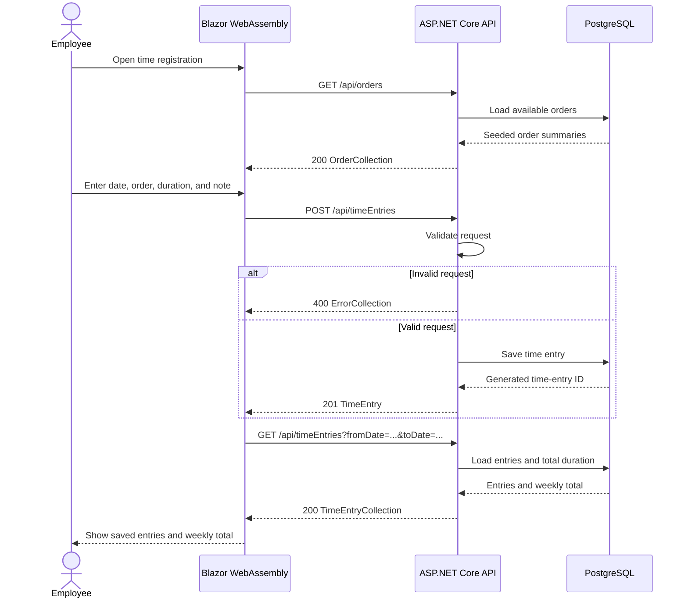

# OrdreFlow API Contract

Status: **Draft**

This document proposes the HTTP and JSON contract for the M1 proof of concept. It is the shared reference for the Blazor frontend and ASP.NET Core backend. It should be updated when the project agrees on a different behavior.

## Scope

The M1 contract supports the first end-to-end employee flow:

- List seeded orders or cases available to the test employee.
- Create a time registration.
- Retrieve saved registrations for a date range.
- Return the total registered duration for that date range.
- Return validation failures in a stable format.

The following are outside this contract:

- Full Microsoft Entra ID authentication.
- Administration and order management.
- Editing or deleting time entries.
- Reports and exports.
- Offline synchronization.
- Start/stop time registration.
- Pagination and advanced filtering.

## M1 Request Flow

The POC flow connects the phone-first frontend to the API and PostgreSQL database:



## Conventions

| Convention | Draft decision |
| --- | --- |
| Base path | `/api` |
| HTTP format | JSON over HTTP(S) |
| JSON property names | camelCase |
| Multi-word URL segments | camelCase |
| Query parameter names | camelCase |
| Date values | `YYYY-MM-DD` date-only strings |
| Duration values | Integer minutes |
| Identifiers | Positive integers for the POC |
| Employee identity | Determined by the authenticated or development user context |

The frontend must not send an `employeeId` when creating or retrieving time entries. The backend owns the employee context and must apply authorization independently of the frontend.

## Resources

### Order summary

An order summary is the minimum information needed to select an order on a phone:

```json
{
  "id": 1,
  "number": "ORD-1001",
  "title": "Example order"
}
```

### Time entry

```json
{
  "id": 42,
  "orderId": 1,
  "orderNumber": "ORD-1001",
  "date": "2026-09-03",
  "durationMinutes": 150,
  "note": "Development work"
}
```

`orderNumber` is included so a saved entry can be displayed without requiring the frontend to resolve the order separately.

## Endpoints

### List available orders

```http
GET /api/orders
```

The endpoint returns the seeded orders available to the current POC user. The response is an envelope so pagination or additional collection metadata can be added later without changing the top-level response type.

Response:

```http
200 OK
```

```json
{
  "items": [
    {
      "id": 1,
      "number": "ORD-1001",
      "title": "Example order"
    }
  ]
}
```

### Create a time entry

```http
POST /api/timeEntries
Content-Type: application/json
```

Request body:

```json
{
  "orderId": 1,
  "date": "2026-09-03",
  "durationMinutes": 150,
  "note": "Development work"
}
```

The request body is intentionally flat. The `requestBody` wrapper in the current backend prototype is an implementation detail and is not part of this contract.

Successful response:

```http
201 Created
Content-Type: application/json
```

```json
{
  "id": 42,
  "orderId": 1,
  "orderNumber": "ORD-1001",
  "date": "2026-09-03",
  "durationMinutes": 150,
  "note": "Development work"
}
```

The response must contain the database-generated `id` of the new time entry.

### Retrieve time entries

```http
GET /api/timeEntries?fromDate=2026-09-01&toDate=2026-09-07
```

`fromDate` and `toDate` are inclusive. The frontend should send both values for the selected week. The endpoint returns entries belonging to the current POC user and the total duration for the requested period.

Response:

```http
200 OK
```

```json
{
  "fromDate": "2026-09-01",
  "toDate": "2026-09-07",
  "items": [
    {
      "id": 42,
      "orderId": 1,
      "orderNumber": "ORD-1001",
      "date": "2026-09-03",
      "durationMinutes": 150,
      "note": "Development work"
    }
  ],
  "totalDurationMinutes": 150
}
```

The backend should return entries ordered by `date` descending, then `id` descending, unless the frontend has a specific display requirement.

## Validation

The backend is the source of truth for validation. The frontend may provide early feedback, but invalid requests must still be rejected by the API.

| Field | Draft rule |
| --- | --- |
| `orderId` | Required and greater than zero. The order must exist and be available to the current user. |
| `date` | Required and must be a valid date-only value. |
| `durationMinutes` | Required integer from `1` through `1440`. |
| `note` | Optional; maximum length is 1000 characters. |
| `fromDate` | Required for the retrieval endpoint and must be a valid date-only value. |
| `toDate` | Required, must be a valid date-only value, and must not be before `fromDate`. |

The POC does not define whether future dates are allowed. That business rule should be decided before the employee MVP is finalized.

## Errors

Validation and other expected operation failures use HTTP status codes and an array of error objects:

```http
400 Bad Request
Content-Type: application/json
```

```json
[
  {
    "code": "INVALID_DURATION",
    "message": "Duration must be between 1 and 1440 minutes.",
    "type": "Validation"
  }
]
```

Expected status codes for the POC are:

| Status | Meaning |
| --- | --- |
| `200` | Successful retrieval |
| `201` | Time entry created |
| `400` | Invalid request or validation failure |
| `404` | Requested order or resource does not exist |
| `500` | Unexpected server failure; implementation details must not be exposed |

Authentication-related `401 Unauthorized` and `403 Forbidden` responses will be added when the M2 authentication and authorization behavior is agreed.

## M2 Evolution

M2 is expected to add authenticated employee context, assigned orders or tasks, and editing of entries when allowed. Those changes should extend this contract rather than make the frontend provide employee identity or bypass backend authorization.

Possible future operations include:

```http
PUT /api/timeEntries/{id}
```

The exact update rules, locking behavior, and delete policy are not part of this draft.

## Current Implementation Gaps

The current backend prototype differs from this draft in several areas:

- It exposes `POST /api/time_entries` instead of `/api/timeEntries`.
- Its request uses a `requestBody` wrapper.
- It uses `workItemId`, `hours`, `startTime`, `endTime`, and `comment`.
- It stores a `DateTime` and decimal hours rather than a date-only value and integer minutes.
- It does not yet expose the orders or time-entry retrieval endpoints.
- It currently returns `200 OK` after creation rather than `201 Created`.
- It does not copy the database-generated time-entry ID into the response command.

These differences are implementation work, not changes to the intended frontend contract.

## Open Decisions

- Whether the domain term should be `order`, `case`, or `workItem`.
- Whether the POC uses a development-only identity or a local authentication setup.
- Whether start/stop timing will be supported in addition to manual duration.
- Whether a common `ProblemDetails` error format should replace the POC error array.
- Whether order selection will later include tasks beneath an order.
